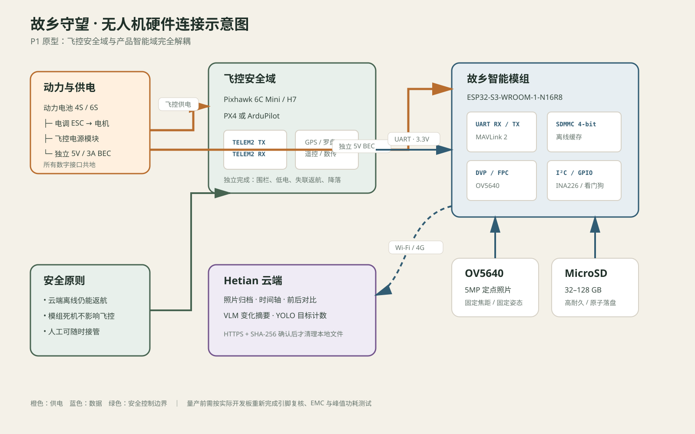
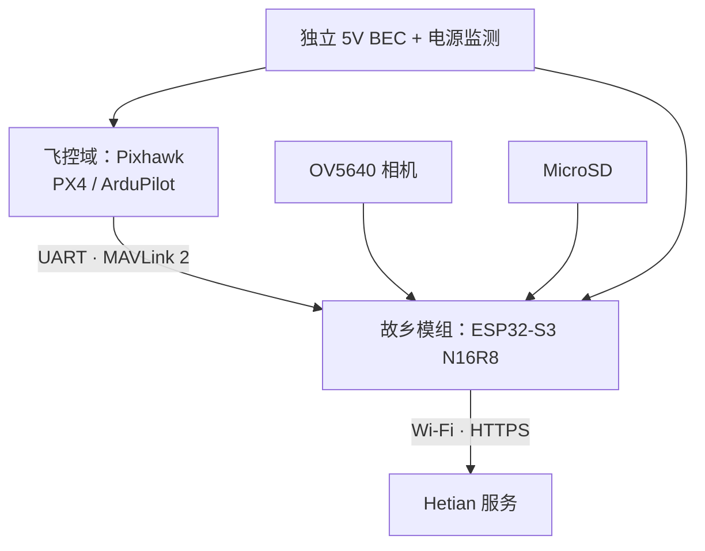

# 故乡守望无人机模组设计 v0.1



## 设计结论

不要用 ESP32-S3 直接承担姿态控制、失控保护和返航。首版采用两个独立计算域：



- **飞控域**只负责飞行：传感器融合、航点、地理围栏、失联和低电返航。
- **故乡模组**负责产品能力：固定观察点触发、照片、缓存、网络、服务端上报和 OTA。
- 两个域分别供电、共地；故乡模组死机不能阻止飞控返航。

## P1 原型模组（建议先做）

| 子系统 | 推荐器件/规格 | 说明 |
|---|---|---|
| 飞控 | Pixhawk 6C Mini 或兼容 H7 飞控 | PX4/ArduPilot，保留完整安全能力 |
| 伴随 MCU | ESP32-S3-WROOM-1-N16R8 | 16 MB Flash、8 MB PSRAM，适合拍照、缓存和联网 |
| 相机 | OV5640，DVP，固定焦距 | 5MP 静态照片；镜头和云台决定可比性 |
| 存储 | 32–128 GB 高耐久 MicroSD | 断网先落盘，上传成功后再归档 |
| 定位 | 飞控 GPS；可预留 RTK | 首版使用飞控位置，P3 再上 RTK |
| 通信 | 2.4 GHz Wi-Fi | 首版回到屋顶 Wi-Fi 后批量上传 |
| 供电 | 5V/3A 独立 BEC，输入随动力电池 | 峰值留裕量，飞控与载荷不要共用弱稳压 |
| 电源监测 | INA226（可选） | 记录载荷电压、电流和掉电原因 |
| 环境 | 温湿度/气压（可选） | 为跨季节影像增加上下文 |

ESP32-S3 不适合本地运行 VLM，也不建议承担高码率长视频编码。P1 拍摄高质量定点照片，服务器做变化检测和目标计数。

## P2 增强模组

如果目标变为 4G 实时上传、1080p 视频、YOLO 预筛选或多摄像头，换成 Linux 伴随计算机：

| 方案 | 适合场景 | 建议配置 |
|---|---|---|
| RK3566 | 低功耗照片/轻量检测 | 2–4 GB RAM、eMMC、MIPI/USB 相机、4G 模组 |
| RK3588S | 多路视频/较强视觉推理 | 8 GB RAM、eMMC/NVMe、主动散热 |

此时 ESP32-S3 可保留为电源与看门狗控制器，RK3566/RK3588 运行 Linux Agent，通过 MAVLink 与飞控连接。

## 电气接口

### 飞控 UART

| 飞控 | ESP32-S3 | 说明 |
|---|---|---|
| TELEM TX | UART RX | 3.3V TTL，交叉连接 |
| TELEM RX | UART TX | 3.3V TTL，交叉连接 |
| GND | GND | 必须共地 |
| 5V | 不直连 | 伴随模组使用独立 BEC |

默认 921600 baud、8N1；线长超过约 20 cm 时降低波特率、加地线并评估干扰。最终 GPIO 由所选开发板确定，通过 `menuconfig` 配置，避免与相机、PSRAM、SDMMC 引脚冲突。

### 电源预算（设计值，不是实测值）

| 负载 | 典型 | 峰值 |
|---|---:|---:|
| ESP32-S3 + PSRAM + Wi-Fi | 0.8 W | 2.0 W |
| OV5640 + MicroSD | 0.5 W | 1.0 W |
| 裕量与外设 | 0.5 W | 2.0 W |
| 合计 | 1.8 W | 5.0 W |

选择 5V/3A BEC 是为了启动、Wi-Fi 发射和 SD 写入瞬态留出裕量。首块板必须实测峰值电流、纹波和温升。

## 固定观察点数据契约

每张照片同时保存 sidecar 元数据：

```json
{
  "mission_id": 42,
  "place_id": "old-house-east",
  "captured_at": "2026-09-20T09:30:00+08:00",
  "lat": 31.352,
  "lon": 118.433,
  "relative_alt_m": 42.0,
  "heading_deg": 92.0,
  "gimbal_pitch_deg": -35.0,
  "route_version": 3,
  "image_sha256": "..."
}
```

跨季节比较依赖相同位置、航向、云台角度、焦距和分辨率。影像先写临时文件，`fsync` 后原子改名；服务端确认 SHA-256 后才允许清理本地文件。

## 安全边界

1. 故乡模组只能请求“拍摄”和上报状态，不能覆盖飞控的地理围栏、返航高度与低电策略。
2. 飞控失联、GPS 质量下降、风速超限或电量不足时，由飞控独立中止任务。
3. 模组通过心跳观察飞控，但不得因云端不可达而阻止返航。
4. OTA 只在落地、解锁状态为 false、电量充足时执行，并使用签名固件与 A/B 分区。
5. 拍摄范围应避开邻居院落、窗户和非授权人员，默认不做人脸身份识别。

## PCB v1 接口预留

- 2× UART：飞控 MAVLink、4G/调试备用。
- 1× DVP/FPC：OV5640。
- 1× MicroSD，优先 4-bit SDMMC。
- 1× USB-C：烧录/日志，不从其给整机供电。
- 1× I²C：INA226/环境传感器。
- 2× GPIO：飞控 ARM 状态输入、相机/伴随板硬件复位。
- TVS、反接保护、LC 滤波、独立看门狗和可控负载开关。

## 验证顺序

1. 桌面：UART 模拟遥测、掉网缓存、断电恢复、连续 500 次上传。
2. 桨叶拆除：飞控真实 MAVLink、航点触发、低电与失联状态。
3. 系留/空旷场：人工监护的单航点拍摄和返航。
4. 固定路线：重复定位误差、照片重合率、网络恢复上传。
5. 经法规与隐私检查后，再尝试定时和远程任务。
