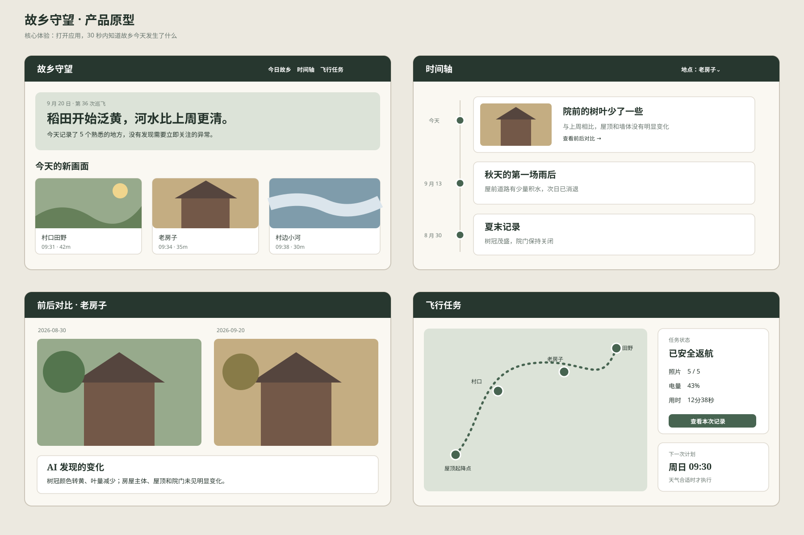

# 产品原型说明

## 核心页面

1. **今日故乡**：不是展示飞行参数，而是用一句自然语言告诉用户故乡今天有什么变化。
2. **时间轴**：以地点为主线查看同一对象跨周、跨季节、跨年的记录。
3. **前后对比**：左右展示尽量相同机位的照片，AI 只描述可验证的变化。
4. **飞行任务**：展示路线、安全状态、照片完成数、电量和下次计划；异常时明确说明是否已返航。

## 用户主路径

`收到故乡日报 → 查看新画面 → 选择熟悉地点 → 前后对比 → 收藏或分享给家人`

飞行任务页面属于辅助能力，不应成为首页中心。用户关心的是“家乡发生了什么”，而不是无人机本身。

## 硬件连接图

